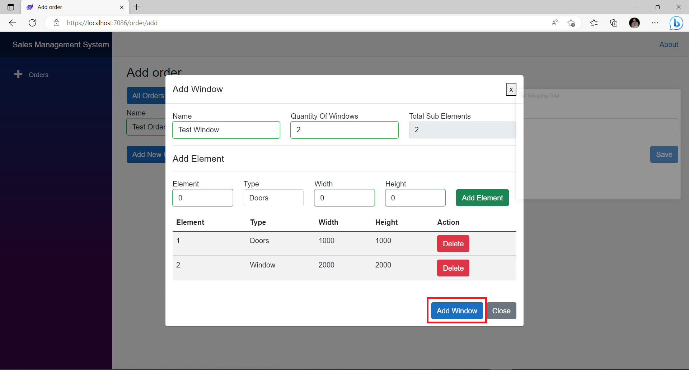

# Sales Management System

## Description

A Blazor WebAssembly app, for managing sales order data. 

## Task Details

1. Create new database tables Using Code First In Entity Framework.
2. Blazor WebAssembly app with an interface to show data from DB.
3. Make an ability to change and save data in the application: state, name, and dimensions.
4. Add the ability to create and delete orders, windows and elements.
5. Optional: Interface validations. DTO. Separated BLL and DAL projects.

## Tools and SDk

1. Visual Studio 2022
2. MS SQL Server 
3. .NET 7.0 SDK

## How to run the project

1. Clone the repository from GitHub ``git clone https://github.com/tanvirIqbal/sales-management-system.git``
2. Run the project in Visual Studio 2022
3. Go to ``Package Manager Console``
  

4. Run this command in Package Manager Console.   
``Update-Database -Project SMS.DAL -StartupProject SMS.Server``

  

If you see any error then check the connection string in ``appsettings.json`` file

  

5. Run the project

  

After Running the project

  

6. Click ``Details`` to see the existing order details.

  

You Can see the existing Order details

  

7. Close the details and click the ``Add`` button to add a new order

  

You can see the new order page

  

8. Fill the Order Name and Order State then click the ``Add new Window`` button

  

You can see the new window and sub element modal

  

9. Fill up the window information and add sub element by clicking the ``Add Element`` button

  

10. You can add the multiple sub element in this modal then click ``Add Window``.

  

You can see the new window with sub element are added to the new order. You can add another window by clicking the ``Add Window`` button. 

11. Click ``Save``

  

Your order is saved.

  

12. Go to Orders page by page. You can see your newly added order.

  

13. For editing a order, click the ``Edit`` button

  

14. You can edit a order and it's window and sub element

  

15. You can also delete a order.

  

You can see that the order is deleted.

